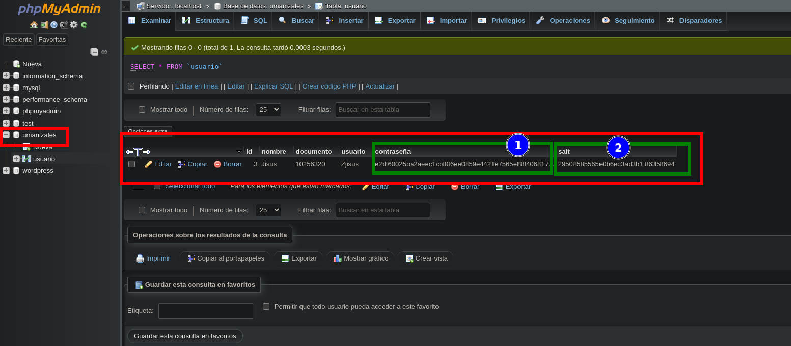

```
CREATE TABLE usuario (
    id INT AUTO_INCREMENT PRIMARY KEY,
    nombre VARCHAR(255) NOT NULL,
    documento VARCHAR(20) NOT NULL,
    usuario VARCHAR(50) NOT NULL,
    contraseña VARCHAR(255) NOT NULL,
    salt VARCHAR(255) NOT NULL -- Nuevo campo para almacenar el valor de sal
);

```
# Imagen



Protegiendo el archivo `config.php` 

`chmod 600 /ruta/a/tu/config.php`
