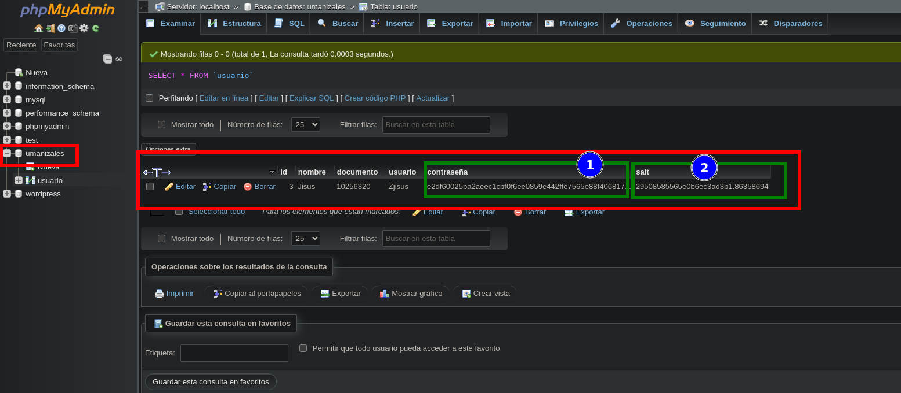
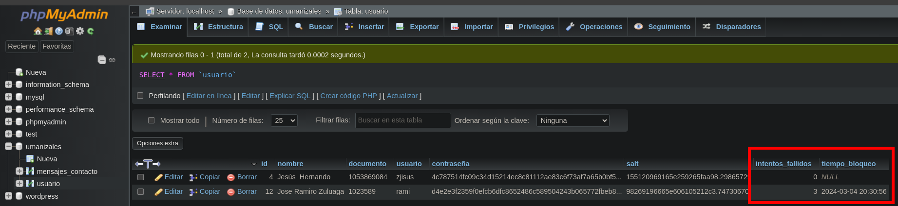
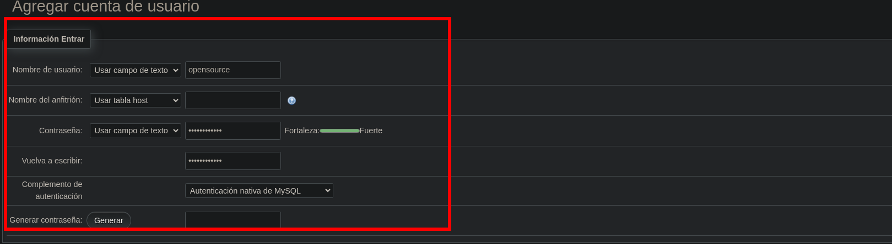
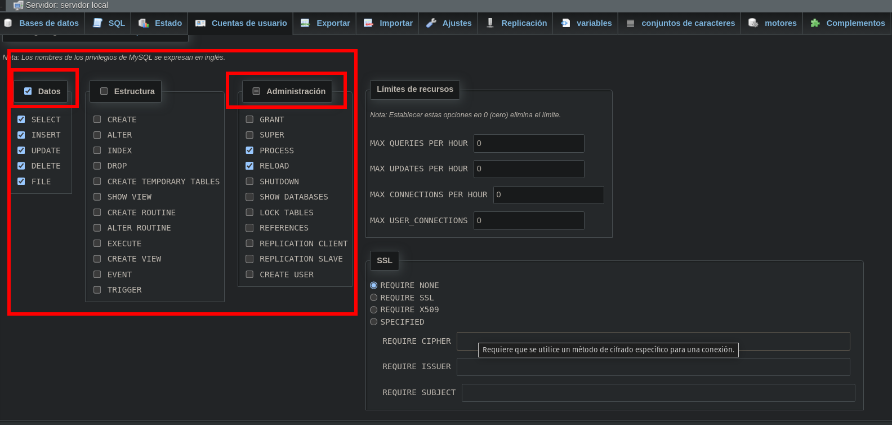

```
CREATE TABLE usuario (
    id INT AUTO_INCREMENT PRIMARY KEY,
    nombre VARCHAR(255) NOT NULL,
    documento VARCHAR(20) NOT NULL,
    usuario VARCHAR(50) NOT NULL,
    contraseña VARCHAR(255) NOT NULL,
    salt VARCHAR(255) NOT NULL -- Nuevo campo para almacenar el valor de sal
);

```
# Imagen



Protegiendo el archivo `config.php` 

`chmod 600 /ruta/a/tu/config.php`


tabla `mensaje de usuarios`
```
CREATE TABLE mensajes_contacto (
    id INT AUTO_INCREMENT PRIMARY KEY,
    nombre VARCHAR(255),
    email VARCHAR(255),
    telefono VARCHAR(15),
    mensaje TEXT,
    fecha_envio TIMESTAMP DEFAULT CURRENT_TIMESTAMP
);

```
agregamos a la base de datos las siguientes columnas 'intentos_fallidos' y 'tiempo_bloqueo'

```
ALTER TABLE usuario ADD COLUMN intentos_fallidos INT DEFAULT 0;
ALTER TABLE usuario ADD COLUMN tiempo_bloqueo DATETIME;

```




Creación de cuenta y deshabilitamos root 'Editar privilegios: Cuenta de usuario' 'opensource'@'127.0.0.1' - 'Base de datos umanizales'






- SELECT: Permite al usuario seleccionar datos de las tablas existentes.
- INSERT: Permite al usuario insertar nuevos registros en las tablas.
- UPDATE: Permite al usuario actualizar registros existentes en las tablas.
- DELETE: Permite al usuario eliminar registros de las tablas.
- CREATE: Permite al usuario crear nuevas tablas, índices o vistas.
- ALTER: Permite al usuario alterar la estructura de las tablas existentes.
- INDEX: Permite al usuario crear y eliminar índices en las tablas.
- DROP: Permite al usuario eliminar tablas o índices existentes.
- CREATE TEMPORARY TABLES: Permite al usuario crear tablas temporales.
- SHOW VIEW: Permite al usuario ver la definición de las vistas.
- CREATE ROUTINE: Permite al usuario crear procedimientos almacenados y funciones.
- ALTER ROUTINE: Permite al usuario modificar procedimientos almacenados y funciones existentes.
- EXECUTE: Permite al usuario ejecutar procedimientos almacenados y funciones.
- CREATE VIEW: Permite al usuario crear nuevas vistas.
- EVENT: Permite al usuario crear, eliminar y modificar eventos en el servidor.
- TRIGGER: Permite al usuario crear y eliminar disparadores en las tablas.
- GRANT: Permite al usuario otorgar permisos a otros usuarios.
- SUPER: Permite al usuario realizar operaciones administrativas, como cambiar la configuración del servidor y detener el servidor.
- PROCESS: Permite al usuario ver todos los procesos que se están ejecutando actualmente.
- RELOAD: Permite al usuario recargar la configuración del servidor.
- SHUTDOWN: Permite al usuario apagar el servidor MySQL.
- SHOW DATABASES: Permite al usuario ver todas las bases de datos.
- LOCK TABLES: Permite al usuario bloquear tablas para operaciones específicas.
- REFERENCES: Permite al usuario crear claves foráneas.
- REPLICATION CLIENT: Permite al usuario ver los registros binarios.
- REPLICATION SLAVE: Permite al usuario configurar el servidor como un esclavo en la replicación.
- CREATE USER: Permite al usuario crear nuevos usuarios de MySQL.