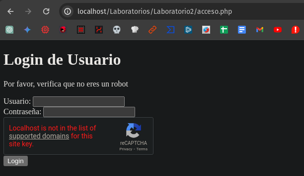

```
<?php
session_start();

// Verificar si el usuario está autenticado
if (isset($_SESSION['usuario'])) {
    header("Location: CRUD.php");
    exit;
}

// Procesar el formulario cuando se envía
if ($_SERVER["REQUEST_METHOD"] == "POST") {
    // Validar datos del formulario
    $usuario = filter_input(INPUT_POST, 'usuario', FILTER_SANITIZE_STRING);
    $clave = filter_input(INPUT_POST, 'clave', FILTER_SANITIZE_STRING);
    
    // Verificar el reCAPTCHA
    $recaptcha_secret = '6LcuwYYpAAAAABaFJId8zlAIdfnipxwY-sRLDPdC';
    $recaptcha_response = $_POST['g-recaptcha-response'];
    $url = 'https://www.google.com/recaptcha/api/siteverify';
    $data = array(
        'secret' => $recaptcha_secret,
        'response' => $recaptcha_response
    );
    $options = array(
        'http' => array (
            'method' => 'POST',
            'content' => http_build_query($data)
        )
    );
    $context = stream_context_create($options);
    $verify = file_get_contents($url, false, $context);
    $captcha_success = json_decode($verify);
    
    if ($captcha_success->success) {
        // Si el reCAPTCHA es válido, continuar con la autenticación del usuario
        if (!empty($usuario) && !empty($clave)) {
            if (authenticate($usuario, $clave)) {
                $_SESSION['usuario'] = $usuario;
                header("Location: CRUD.php");
                exit;
            } else {
                $error_message = "Credenciales incorrectas";
            }
        } else {
            $error_message = "Por favor, ingrese usuario y contraseña";
        }
    } else {
        // Si el reCAPTCHA no es válido, mostrar un mensaje de error
        $error_message = "Por favor, verifica que no eres un robot";
    }
}

// Función de autenticación simulada
function authenticate($usuario, $clave) {
    // Simulación de una consulta a la base de datos para verificar las credenciales
    $usuarios = array(
        "jisus" => "1q2w3e4r5t"
    );

    return isset($usuarios[$usuario]) && $usuarios[$usuario] === $clave;
}
?>

<!DOCTYPE html>
<html lang="es">
<head>
    <meta charset="UTF-8">
    <meta name="viewport" content="width=device-width, initial-scale=1.0">
    <title>Login</title>
    <style>
        /* Estilos CSS aquí */
    </style>
    <script src="https://www.google.com/recaptcha/api.js" async defer></script>
</head>
<body>
    <div class="container">
        <h1>Login de Usuario</h1>
        <?php if(isset($error_message)) echo "<p class='error-message'>$error_message</p>"; ?>
        <form action="<?php echo htmlspecialchars($_SERVER["PHP_SELF"]); ?>" method="post">
            <label for="usuario">Usuario:</label>
            <input type="text" id="usuario" name="usuario" required><br>
            <label for="clave">Contraseña:</label>
            <input type="password" id="clave" name="clave" required><br>
            <div class="g-recaptcha" data-sitekey="6LcuwYYpAAAAAFV_qzLdffg4j4241a2LDw4LeEAl"></div>
            <input type="submit" value="Login">
        </form>
    </div>
</body>
</html>

```

