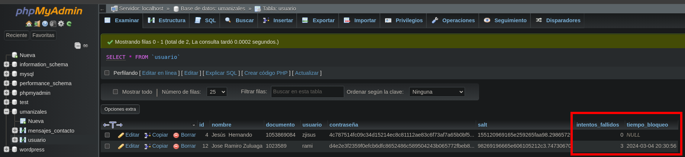
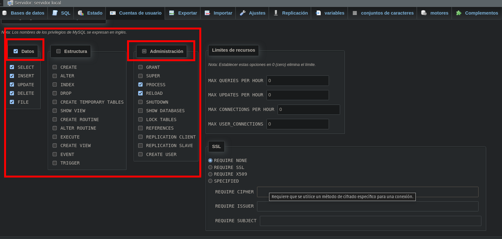

```
CREATE TABLE usuario (
    id INT AUTO_INCREMENT PRIMARY KEY,
    nombre VARCHAR(255) NOT NULL,
    documento VARCHAR(20) NOT NULL,
    usuario VARCHAR(50) NOT NULL,
    contraseña VARCHAR(255) NOT NULL,
    salt VARCHAR(255) NOT NULL -- Nuevo campo para almacenar el valor de sal
);

```
# Imagen


Protegiendo el archivo `config.php` 

`chmod 600 /ruta/a/tu/config.php`


tabla `mensaje de usuarios`
```
CREATE TABLE mensajes_contacto (
    id INT AUTO_INCREMENT PRIMARY KEY,
    nombre VARCHAR(255),
    email VARCHAR(255),
    telefono VARCHAR(15),
    mensaje TEXT,
    fecha_envio TIMESTAMP DEFAULT CURRENT_TIMESTAMP
);

```
agregamos a la base de datos las siguientes columnas 'intentos_fallidos' y 'tiempo_bloqueo'

```
ALTER TABLE usuario ADD COLUMN intentos_fallidos INT DEFAULT 0;
ALTER TABLE usuario ADD COLUMN tiempo_bloqueo DATETIME;

```




Creación de cuenta y deshabilitamos root 'Editar privilegios: Cuenta de usuario' 'opensource'@'127.0.0.1' - 'Base de datos umanizales'





- SELECT: Permite al usuario seleccionar datos de las tablas existentes.
- INSERT: Permite al usuario insertar nuevos registros en las tablas.
- UPDATE: Permite al usuario actualizar registros existentes en las tablas.
- DELETE: Permite al usuario eliminar registros de las tablas.
- CREATE: Permite al usuario crear nuevas tablas, índices o vistas.
- ALTER: Permite al usuario alterar la estructura de las tablas existentes.
- INDEX: Permite al usuario crear y eliminar índices en las tablas.
- DROP: Permite al usuario eliminar tablas o índices existentes.
- CREATE TEMPORARY TABLES: Permite al usuario crear tablas temporales.
- SHOW VIEW: Permite al usuario ver la definición de las vistas.
- CREATE ROUTINE: Permite al usuario crear procedimientos almacenados y funciones.
- ALTER ROUTINE: Permite al usuario modificar procedimientos almacenados y funciones existentes.
- EXECUTE: Permite al usuario ejecutar procedimientos almacenados y funciones.
- CREATE VIEW: Permite al usuario crear nuevas vistas.
- EVENT: Permite al usuario crear, eliminar y modificar eventos en el servidor.
- TRIGGER: Permite al usuario crear y eliminar disparadores en las tablas.
- GRANT: Permite al usuario otorgar permisos a otros usuarios.
- SUPER: Permite al usuario realizar operaciones administrativas, como cambiar la configuración del servidor y detener el servidor.
- PROCESS: Permite al usuario ver todos los procesos que se están ejecutando actualmente.
- RELOAD: Permite al usuario recargar la configuración del servidor.
- SHUTDOWN: Permite al usuario apagar el servidor MySQL.
- SHOW DATABASES: Permite al usuario ver todas las bases de datos.
- LOCK TABLES: Permite al usuario bloquear tablas para operaciones específicas.
- REFERENCES: Permite al usuario crear claves foráneas.
- REPLICATION CLIENT: Permite al usuario ver los registros binarios.
- REPLICATION SLAVE: Permite al usuario configurar el servidor como un esclavo en la replicación.
- CREATE USER: Permite al usuario crear nuevos usuarios de MySQL.


**tabla horarios**

```
CREATE TABLE horarios (
    id INT AUTO_INCREMENT PRIMARY KEY,
    codigo VARCHAR(10) NOT NULL,
    asignatura VARCHAR(255) NOT NULL,
    grupo INT NOT NULL,
    dia_semana VARCHAR(10) NOT NULL,
    hora_inicio VARCHAR(50) NOT NULL,
    hora_fin VARCHAR(50) NOT NULL,
    salon VARCHAR(50) NOT NULL
);

-- Insertar algunos datos de muestra
INSERT INTO horarios (codigo, asignatura, grupo, dia_semana, hora_inicio, hora_fin, salon) VALUES
('IS040702', 'Criptografía Aplicada', 2, 'lunes', '18:30', '21:10', 'Aula D 405'),
('IA030705', 'Ética', 2, 'martes', '18:30', '19:20', 'Aula D 203'),
('IS040704', 'Gestión de Riesgos de la Información', 2, 'miércoles', '20:20', '22:00', 'Aula B 105'),
('IS040705', 'Profundización I', 2, 'lunes', '18:30', '21:10', 'Aula C 105'),
('IS040701', 'Seguridad en Desarrollo de Software', 2, 'martes', '19:20', '22:00', 'Aula D 403'),
('IS040703', 'Seguridad en Infraestructura II', 2, 'miércoles', '19:20', '22:00', 'Aula A 201');


```

Tabla de horario de docentes

```
CREATE TABLE docentes (
    id INT AUTO_INCREMENT PRIMARY KEY,
    codigo VARCHAR(10) NOT NULL,
    nombre VARCHAR(255) NOT NULL,
    asignatura VARCHAR(255) NOT NULL,
    grupo INT NOT NULL,
    dia_semana VARCHAR(10) NOT NULL,
    hora_inicio VARCHAR(50) NOT NULL,
    hora_fin VARCHAR(50) NOT NULL,
    salon VARCHAR(50) NOT NULL
);


INSERT INTO docentes (codigo, nombre, asignatura, grupo, dia_semana, hora_inicio, hora_fin, salon)
VALUES
('IS040702', 'Juan Pérez', 'Criptografía Aplicada', 2, 'lunes', '18:30', '21:10', 'Aula D 405'),
('IA030705', 'María García', 'Ética', 2, 'martes', '18:30', '19:20', 'Aula D 203'),
('IS040704', 'Pedro López', 'Gestión de Riesgos de la Información', 2, 'miércoles', '20:20', '22:00', 'Aula B 105'),
('IS040705', 'Ana Martínez', 'Profundización I', 2, 'lunes', '18:30', '21:10', 'Aula C 105'),
('IS040701', 'Carlos Rodríguez', 'Seguridad en Desarrollo de Software', 2, 'martes', '19:20', '22:00', 'Aula D 403'),
('IS040703', 'Laura Gómez', 'Seguridad en Infraestructura II', 2, 'miércoles', '19:20', '22:00', 'Aula A 201'),
('IS040702', 'Juan Pérez', 'Criptografía Aplicada', 1, 'lunes', '9:30', '12:10', 'Aula A 505'),
('IA030705', 'María García', 'Ética', 1, 'martes', '8:30', '9:20', 'Aula D 303'),
('IS040704', 'Pedro López', 'Gestión de Riesgos de la Información', 1, 'miércoles', '14:20', '17:00', 'Aula B 405'),
('IS040705', 'Ana Martínez', 'Profundización I', 1, 'lunes', '6:30', '10:10', 'Aula B 105'),
('IS040701', 'Carlos Rodríguez', 'Seguridad en Desarrollo de Software', 1, 'martes', '8:20', '12:00', 'Aula D 203'),
('IS040703', 'Laura Gómez', 'Seguridad en Infraestructura II', 1, 'miércoles', '11:20', '15:00', 'Aula B 501');

```


```sql
CREATE TABLE notas (
    id INT AUTO_INCREMENT PRIMARY KEY,
    estudiante_codigo VARCHAR(10) NOT NULL,
    asignatura VARCHAR(255) NOT NULL,
    corte1 FLOAT,
    corte2 FLOAT,
    corte3 FLOAT,
    FOREIGN KEY (estudiante_codigo) REFERENCES estudiantes(codigo)
);
```

```sql
CREATE TABLE estudiantes (
    codigo VARCHAR(10) PRIMARY KEY,
    nombre VARCHAR(255) NOT NULL
);
```

-- Datos de ejemplo para estudiantes
INSERT INTO estudiantes (codigo, nombre) VALUES
('2022001', 'Juan Pérez'),
('2022002', 'María García'),
('2022003', 'Pedro López');

-- Datos de ejemplo para notas
INSERT INTO notas (estudiante_codigo, asignatura, corte1, corte2, corte3) VALUES
('2022001', 'Criptografía Aplicada', 4.5, 3.8, 4.2),
('2022001', 'Ética', 3.9, 4.1, 3.7),
('2022001', 'Gestión de Riesgos de la Información', 4.0, 3.5, 4.3),
('2022001', 'Profundización I', 4.2, 3.7, 4.5),
('2022001', 'Seguridad en Desarrollo de Software', 3.8, 4.0, 4.2),
('2022001', 'Seguridad en Infraestructura II', 4.1, 3.9, 4.4),
('2022002', 'Criptografía Aplicada', 4.3, 4.0, 4.1),
('2022002', 'Ética', 4.2, 4.3, 4.0),
('2022002', 'Gestión de Riesgos de la Información', 3.9, 4.2, 3.8),
('2022002', 'Profundización I', 4.0, 3.9, 4.1),
('2022002', 'Seguridad en Desarrollo de Software', 3.7, 3.8, 3.9),
('2022002', 'Seguridad en Infraestructura II', 3.8, 3.7, 4.0),
('2022003', 'Criptografía Aplicada', 4.1, 4.2, 3.9),
('2022003', 'Ética', 4.0, 4.1, 4.0),
('2022003', 'Gestión de Riesgos de la Información', 3.8, 3.9, 3.7),
('2022003', 'Profundización I', 3.9, 4.0, 3.8),
('2022003', 'Seguridad en Desarrollo de Software', 3.6, 3.7, 3.5),
('2022003', 'Seguridad en Infraestructura II', 3.7, 3.6, 3.9);
