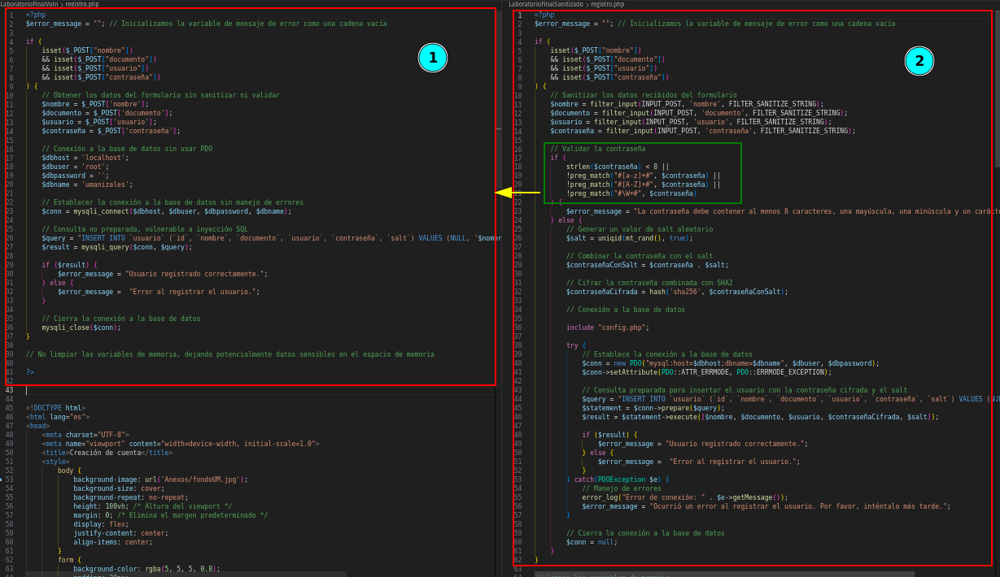
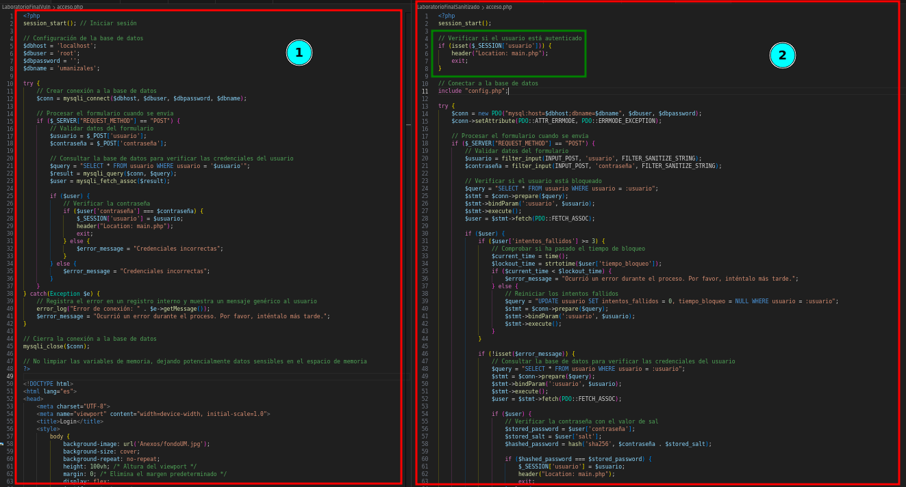

## Vectores de ataque potenciales para generar codigo arbitrario


## Descripción del proyecto

### Vectores de ataque potenciales para la generación de código arbitrario

1. **Falta de validación de complejidad de contraseñas:** El sistema carece de mecanismos para evaluar y asegurar la complejidad de las contraseñas utilizadas, lo que puede facilitar ataques de fuerza bruta o de diccionario.

2. **Transmisión no cifrada de contraseñas a la base de datos:** Las contraseñas no se están transmitiendo de forma segura a la base de datos, lo que las expone a posibles interceptaciones maliciosas durante su tránsito.

3. **Carencia de validaciones y uso de sentencias preparadas en inputs:** Los datos ingresados por los usuarios no están siendo adecuadamente validados ni procesados mediante sentencias preparadas, lo que deja al sistema vulnerable a ataques de inyección de código.

4. **Hardcodeo de credenciales y datos sensibles en el código:** La inclusión directa de credenciales y datos sensibles en el código fuente expone dicha información a posibles compromisos de seguridad, ya que puede ser fácilmente accesible para actores malintencionados.

5. **No eliminación de variables en memoria:** La falta de eliminación de variables en memoria puede dar lugar a fugas de información sensible, lo que aumenta el riesgo de exposición de datos confidenciales.

6. **Falta de verificación de autenticación en el inicio de sesión:** La ausencia de comprobación de autenticación en la sesión inicial deja al sistema expuesto a ataques de fuzzing y otros intentos de acceso no autorizado.

7. **No verificación en la base de datos del estado del usuario y gestión de intentos de sesión:** El sistema no verifica en la base de datos si un usuario está bloqueado por exceder el límite de intentos de sesión, ni realiza el adecuado seguimiento y restablecimiento de dichos intentos.

8. **Consultas vulnerables a inyección de SQL:** La concatenación directa de variables en las consultas a la base de datos abre la puerta a ataques de inyección de SQL, permitiendo a un atacante manipular las consultas para obtener información no autorizada o realizar acciones maliciosas.

9. **Sesiones sin expiración:** Las sesiones no tienen un tiempo de expiración definido, lo que aumenta el riesgo de acceso no autorizado a la cuenta del usuario.

10. **Transmisión no cifrada de datos con HTTP en lugar de HTTPS:** La falta de cifrado en la transmisión de datos expone la información a posibles interceptaciones y manipulaciones por parte de terceros malintencionados.

11. **Revelación de información crítica del servidor:** El sistema muestra información crítica del servidor directamente al usuario, lo que podría ser utilizado por un atacante para identificar y explotar vulnerabilidades.

12. **Uso de usuarios predefinidos para conexiones a la base de datos:** El uso de usuarios predefinidos para conexiones a la base de datos aumenta el riesgo de compromiso de la integridad y confidencialidad de los datos almacenados.

13. **Falta de cierre seguro de conexiones a la base de datos:** La falta de cierre adecuado de las conexiones a la base de datos puede dejar al sistema vulnerable a ataques de denegación de servicio y otros vectores de ataque.

14. **Falta de sanitización de datos recibidos de formularios:** La omisión de la sanitización de los datos recibidos de los formularios expone al sistema a posibles ataques de inyección de código y otros exploits.

15. **No validación de contraseñas y uso de salting:** La falta de validación de contraseñas y el uso de salting aumenta el riesgo de ataques de fuerza bruta y de diccionario, así como de compromisos de seguridad de las contraseñas almacenadas.

16. **Falta de uso de algoritmos seguros de cifrado, como SHA-2:** La ausencia de algoritmos de cifrado seguros expone las contraseñas y otros datos sensibles a posibles compromisos de seguridad y violaciones de la privacidad.

17. **Falta de manejo seguro de errores:** La carencia de un manejo adecuado de errores puede exponer información sensible y facilitar la identificación de posibles vulnerabilidades en el sistema.

18. **Validaciones de JavaScript inseguras con innerHTML:** Las validaciones inseguras de JavaScript utilizando innerHTML pueden dejar al sistema vulnerable a ataques de scripting entre sitios (XSS) y otros exploits.

19. **Cookies de sesión inseguras:** La falta de seguridad en las cookies de sesión puede exponer al sistema a ataques de secuestro de sesión y otros vectores de ataque relacionados con la gestión de sesiones.

19. Filtrando listas blancas en lo inputs

20. Recolectando metricas y metadatos de los usuarios que se estan conectando

21. imprimiendo ip de conexion y ultimo ingreso al sistema web

23. prevenir ataques de fuerza bruta basados en el agente de usuario


# Clasificacion de lo vectores encontrados con el OWASP TOP 10

### Vectores de ataque potenciales para generar código arbitrario

1. **Falta de validación de complejidad de contraseñas**
2. **Transmisión de contraseñas en texto plano sin cifrar** (OWASP Top 10: A2 - Riesgo de Autenticación Insuficiente)
3. **Falta de validación y uso de sentencias preparadas en inputs** (OWASP Top 10: A1 - Inyección de SQL)
4. **Hardcodeo de credenciales y datos sensibles en el código** (OWASP Top 10: A3 - Exposición de Datos Sensibles)
5. **Falta de eliminación de variables en memoria** (OWASP Top 10: A8 - Exposición de Recursos Críticos)
6. **Falta de autenticación en el index de sesión, susceptible a ataques de fuzzing** (OWASP Top 10: A2 - Riesgo de Autenticación Insuficiente)
7. **No verifica si el usuario está bloqueado por intentos de sesión en la base de datos** (OWASP Top 10: A2 - Riesgo de Autenticación Insuficiente)
8. **Consultas de base de datos vulnerables a SQL Injection** (OWASP Top 10: A1 - Inyección de SQL)
9. **Sesiones sin expiración** (OWASP Top 10: A3 - Exposición de Datos Sensibles)
10. **Transmisión de datos sin cifrar con HTTP en lugar de HTTPS** (OWASP Top 10: A6 - Falta de Protección de Datos Sensibles)
11. **Revelación de información crítica del servidor** (OWASP Top 10: A6 - Falta de Protección de Datos Sensibles)
12. **Uso de usuarios predeterminados para conexiones a la base de datos** (OWASP Top 10: A5 - Utilización de Componentes con Vulnerabilidades Conocidas)
13. **Falta de cierre seguro de conexiones a la base de datos** (OWASP Top 10: A1 - Inyección de SQL)
14. **Falta de sanitización de datos recibidos de formularios** (OWASP Top 10: A1 - Inyección de SQL)
15. **Falta de validación de contraseñas y uso de salting** (OWASP Top 10: A2 - Riesgo de Autenticación Insuficiente)
16. **Falta de uso de algoritmos seguros de cifrado (por ejemplo, SHA-2)** (OWASP Top 10: A6 - Falta de Protección de Datos Sensibles)
17. **Falta de manejo seguro de errores** (OWASP Top 10: A5 - Utilización de Componentes con Vulnerabilidades Conocidas)
18. **Uso inseguro de innerHTML en validaciones de JavaScript** (OWASP Top 10: A7 - Exposición de Funcionalidades Peligrosas)
19. **Cookies de sesión inseguras** (OWASP Top 10: A2 - Riesgo de Autenticación Insuficiente)


# versus codigo seguro & codigo inseguro

1. Falta de validación de complejidad de contraseñas.


2. Transmisión no cifrada de contraseñas a la base de datos.


3. Carencia de validaciones y uso de sentencias preparadas en inputs.


4. Hardcodeo de credenciales y datos sensibles en el código.


5. No eliminación de variables en memoria.


6. Falta de verificación de autenticación en el inicio de sesión.


7. No verificación en la base de datos del estado del usuario y gestión de intentos de sesión.


8. Consultas vulnerables a inyección de SQL concatenando la variable directamente.


```
1Q2w3e4r5t'; DROP TABLE usuario;-- //Ejemplo en input de password podemos colocar esto para probar

```


```
En este ajuste, he cambiado los marcadores de posición de la consulta preparada de ? a :nombre, :documento, :usuario, :contraseñaCifrada, y :salt. Luego, he utilizado el método bindParam para vincular las variables correspondientes a estos marcadores de posición. Esto hace que el código sea más seguro y menos susceptible a ataques de inyección SQL.


```

9. Sesiones no caducan en cierto periodo de tiempo.


10. Transmisión no cifrada de datos con HTTP en lugar de HTTPS.
**Certificado autofirmado HTTPS**


11. Revelación de información crítica del servidor.


12. Uso de usuarios predefinidos para conexiones a la base de datos.


13. Falta de cierre seguro de conexiones a la base de datos.


```
 la opción más segura y recomendada es `$conn = null;`. Aquí te explico por qué:

1. `$conn = null;`: Esta opción asigna `null` a la variable `$conn`, lo que significa que la conexión se cierra y se elimina de la memoria. Es una práctica común y segura para cerrar las conexiones a la base de datos en PHP.

2. `mysqli_close($conn);`: Esta función también cierra la conexión a la base de datos, pero requiere pasar la variable de conexión como argumento. Es una forma más explícita de cerrar la conexión, pero no necesariamente más segura que la asignación de `null`.

La diferencia principal entre las dos opciones radica en el nivel de control y claridad en el código. Usar `$conn = null;` es más claro y directo, mientras que `mysqli_close($conn);` requiere llamar a una función adicional. Además, `$conn = null;` es compatible con otros tipos de conexiones a la base de datos, no solo con MySQLi, lo que lo hace más versátil.


```

14. Falta de sanitización de datos recibidos de formularios. Validaciones de JavaScript inseguras con innerHTML.
```md

1. **Validación del lado del cliente solamente**: Un atacante puede fácilmente evitar las validaciones del lado del cliente manipulando el código fuente en el navegador o utilizando herramientas como el Inspector de elementos para modificar los valores de los campos del formulario. Por ejemplo, un atacante podría enviar datos maliciosos o vacíos directamente al servidor sin ser validados por el cliente.

2. **Falta de validación del lado del servidor**: Si el servidor no valida adecuadamente los datos recibidos del formulario, un atacante podría explotar esto enviando datos maliciosos diseñados para explotar vulnerabilidades en la lógica de la aplicación o en la base de datos. Por ejemplo, un atacante podría enviar scripts maliciosos o consultas SQL diseñadas para comprometer la seguridad de la aplicación.

3. **Manejo de errores insuficiente**: Si el código no maneja adecuadamente los errores de red o del servidor, un atacante podría aprovechar esto para realizar ataques de denegación de servicio (DoS) o para recopilar información sobre la infraestructura del servidor. Por ejemplo, un atacante podría realizar múltiples solicitudes simultáneas para sobrecargar el servidor o para obtener información sensible sobre las respuestas de error.

4. **Exposición de mensajes de alerta**: Los mensajes de alerta utilizados en el código pueden revelar información sensible sobre la estructura o el funcionamiento interno de la aplicación. Un atacante podría aprovechar esto para obtener información sobre posibles vulnerabilidades o puntos de entrada en la aplicación. Por ejemplo, un mensaje de alerta que indica que un campo específico es obligatorio podría revelar a un atacante información sobre cómo manipular el formulario para evadir las validaciones del lado del cliente.

5. **Posible inseguridad en la transmisión de datos**: Si los datos del formulario se envían al servidor sin cifrar ni proteger adecuadamente la transmisión de datos, un atacante podría interceptar y leer los datos enviados utilizando técnicas de ataque de intermediarios, como el secuestro de sesiones o el análisis de tráfico de red. Esto podría permitir al atacante robar información confidencial, como contraseñas o datos de tarjetas de crédito, transmitidos entre el cliente y el servidor.


```

```Js
<!-- Campo de nombre -->
<script>
    document.getElementById('nombre').value = ''; // Campo vacío
</script>

<!-- Campo de email -->
<script>
    document.getElementById('email').value = 'correo_malicioso@atacante.com'; // Email malicioso
</script>

<!-- Campo de fecha de nacimiento -->
<script>
    document.getElementById('fechaNacimiento').value = '01/01/1970'; // Fecha de nacimiento maliciosa
</script>

<!-- Campo de género -->
<script>
    document.getElementById('genero').checked = false; // Género no seleccionado
</script>

<!-- Campo de carrera -->
<script>
    document.getElementById('carrera').value = ''; // Carrera no seleccionada
</script>

<!-- Campo de semestre -->
<script>
    document.getElementById('semestre').value = '0'; // Semestre malicioso
</script>

<!-- Campo de contraseña -->
<script>
    document.getElementById('password').value = 'mypassword\'; DROP TABLE usuario;--'; // Contraseña maliciosa
</script>

<!-- Campo de confirmación de contraseña -->
<script>
    document.getElementById('passwordConfirmation').value = 'mypassword\'; DROP TABLE usuario;--'; // Confirmación de contraseña maliciosa
</script>

<!-- Campo de aceptación de términos y condiciones -->
<script>
    document.getElementById('aceptoTerminosYCondiciones').checked = false; // Términos y condiciones no aceptados
</script>

```

Para mejorar la seguridad del código, se recomienda implementar las siguientes prácticas:

- Validar y sanitizar todos los datos del formulario en el lado del servidor antes de procesarlos.

- Implementar medidas de protección contra XSS, como la codificación de salida de datos y el uso de encabezados de seguridad HTTP como Content Security Policy (CSP).

- Utilizar tokens CSRF para protegerse contra ataques de CSRF.
- Encriptar la comunicación entre el cliente y el servidor utilizando HTTPS.
- Implementar un manejo adecuado de errores y mensajes de usuario para proporcionar retroalimentación clara y útil al usuario.


Cambios realizados pra mejorar la seguirdad del codigo 
Cambios realizados:

- Se agregaron etiquetas <label> asociadas a los campos del formulario para mejorar la accesibilidad.
- Se implementó la validación de campos tanto en el lado del cliente como en el lado del servidor para mayor seguridad.
- Se utilizó una expresión regular para validar el formato del correo electrónico.
- Se agregaron mensajes de error dinámicos para cada campo del formulario.
- Se estableció el tipo de contenido de la solicitud XMLHttpRequest como application/x-www-form-urlencoded.
- Se agregó una función para limpiar el formulario después de un registro exitoso.
- Se realizaron ajustes en la lógica para asegurar que los datos se envíen correctamente al servidor y se procesen de manera segura


15. No validación de contraseñas y uso de salting.


16. Falta de uso de algoritmos seguros de cifrado, como SHA-2.


17. Falta de manejo seguro de errores.


18. Cookies de sesión inseguras.
**Time token sessión**


19. Filtrando listas blancas en lo inputs


20. Recolectando metricas y metadatos de los usuarios que se estan conectando


21. imprimiendo ip de conexion y ultimo ingreso al sistema web


23. prevenir ataques de fuerza bruta basados en el agente de usuario

```
// Verificar si hay múltiples solicitudes con el mismo agente de usuario pero desde diferentes direcciones IP
function detectarFuerzaBruta($user_agent, $ip_usuario) {
    // Consultar la base de datos u otro sistema de registro para buscar patrones sospechosos
    // Aquí solo se muestra un ejemplo simple
    $num_solicitudes = 5; // Número máximo de solicitudes permitidas con el mismo agente de usuario
    $intervalo_tiempo = 60; // Intervalo de tiempo en segundos para considerar las solicitudes como sospechosas
    
    // Consultar la base de datos para contar las solicitudes recientes con el mismo agente de usuario
    $num_solicitudes_recientes = 0; // Aquí asumimos que no hay ninguna solicitud reciente con el mismo agente de usuario
    
    // Si se detectan más solicitudes de las permitidas en el intervalo de tiempo especificado
    if ($num_solicitudes_recientes > $num_solicitudes) {
        // Puedes registrar esta actividad en un archivo de registro o en la base de datos para futuras investigaciones
        // Puedes tomar medidas adicionales, como bloquear la dirección IP del usuario en tu firewall
        // Por ahora, simplemente retornamos true para indicar que se detectó un posible ataque de fuerza bruta
        return true;
    }
    
    // Si no se detectan patrones sospechosos, retornar false
    return false;
}

// Verificar si hay actividad reciente del usuario
if (isset($_SESSION['ultima_actividad']) && (time() - $_SESSION['ultima_actividad'] > 900)) { // 900 segundos = 15 minutos
    logout();
}

// Actualizar la última actividad del usuario
$_SESSION['ultima_actividad'] = time();

// Obtener el agente de usuario del cliente y la dirección IP del usuario
$user_agent = $_SERVER['HTTP_USER_AGENT'];
$ip_usuario = $_SERVER['REMOTE_ADDR'];

// Verificar si se está produciendo un ataque de fuerza bruta
if (detectarFuerzaBruta($user_agent, $ip_usuario)) {
    // Si se detecta un ataque de fuerza bruta, mostrar una notificación al usuario y bloquear las solicitudes adicionales
    echo "¡Atención! Detectamos un posible ataque de fuerza bruta. Por razones de seguridad, tu acceso ha sido bloqueado temporalmente.";
    exit;
}

// ...
```

